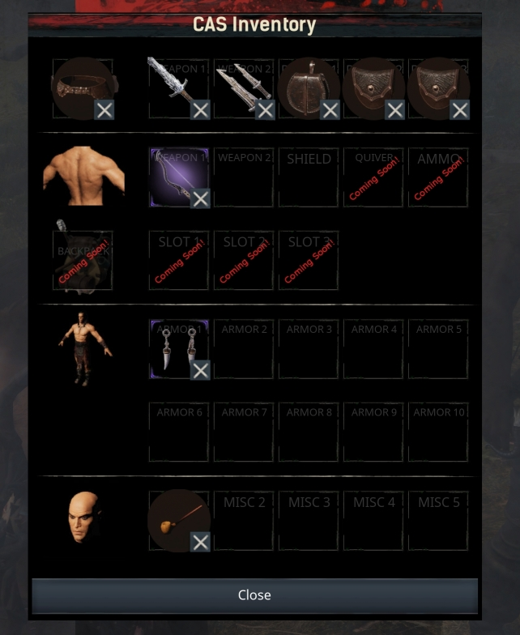

# CAS

### What is CAS?
This mod for [Conan Exiles](https://www.conanexiles.com) adds a new inventory panel to your character and thralls, allowing you to equip much more than the 5 standard armor slots.
There are two types of items that can be equipped:

- **Cosmetic items**: sheathed weapons, jewellery, masks, smoking pipes, etc.
- **Functional items**: wearables that offer a buff or boost to your character.

### Which items can I equip?

#### Weapons

First of all, you can equip any combination of weapons and/or shields on an appropriate location: either on your belt, or on your back.

#### Belts

Second, there is a **belt** system which allows you to craft and equip belts. The better the quality of the belt, the more **pouch** slots it will unlock. In these pouch slots, you can equip... pouches! Pouches are functional attachments: each equipped pouch will give your character a specific buff.

#### Backpacks

By learning the appropriate feat, you can also craft **backpacks**. When you equip these, you will unlock one or more backpack slots, into which you can attach more weapons or items.

#### Armor

In the armor slots, you can place pieces of armor, which will render their looks on top of whatever you are currently wearing.
Please note that this feature is still experimental, and has several limitations. Dyes won't work, and some armor pieces will show a different skin color underneath.

#### Cosmetics

CAS also offers several miscellaneous cosmetic items that you can equip in the Misc slots. More cosmetics will be added with future updates!

### Where are these items? How can I craft them?

In order to craft the CAS items, you need to learn the feats first:

- **Belt Crafter**: unlocks the crafting of belts and pouches
- **Backpack Crafter**: unlocks the crafting of backpacks
- **Wearable Accessory Crafter**: unlocks the crafting of cosmetic items

Once you have learned these feats, you can craft the items in various crafting stations:

- **Belts and Pouches**: can be crafted at the *Armorer's Bench*. The high-tier belt can be crafted at the *Improved Armorer's Bench*.
- **Backpacks**: can be crafted at the *Armorer's Bench*. The high-tier backpack can be crafted at the *Improved Armorer's Bench*.
- **Cosmetics**: can be crafted at the *Artisan Table*.

### For Admins and Modders

- The ID of this mod is `2086135111`

- This mod uses the item range `642000` - `642100`

- This mod is open source! You can find the Unreal assets here on GitHub. Feel free to take a look around, clone the repo, and try it out for yourself in the Conan Exiles devkit. I am always looking to improve the code, so any feedback is welcome! Or, if you are feeling generous, why not send me a pull request with fixes, improvements or new features? ;)
