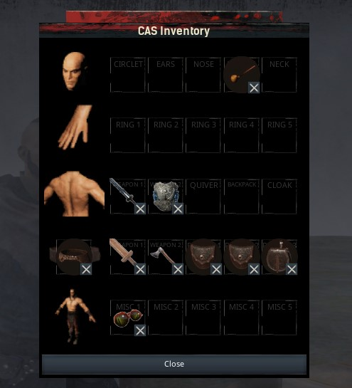

# CAS

### What is CAS?
This mod for [Conan Exiles](https://www.conanexiles.com) adds a new inventory panel to your character, allowing you to equip much more than the 5 standard armor slots.
There are two types of items that can be equipped:

- **Cosmetic items**: sheathed weapons, jewellery, masks, smoking pipes, etc.
- **Functional items**: wearables that offer a buff or boost to your character.

### Which items can I equip?

First of all, you can equip any combination of weapons and/or shields on an appropriate location: either on your belt, or on your back.

Second, there is a **belt** system which allows you to craft and equip belts. The better the quality of the belt, the more **pouch** slots it will unlock. In these pouch slots, you can equip... pouches! Pouches are functional attachments: each equipped pouch will give your character a specific buff.

CAS also offers several cosmetic items that you can equip in the Misc slots. More cosmetics will be added with future updates!

### Where are these items? How can I craft them?

In order to craft the CAS items, you need to learn the feats first:

- **Belt Crafter**: unlocks the crafting of belts and pouches
- **Wearable Accessory Crafter**: unlocks the crafting of cosmetic items

Once you have learned these feats, you can craft the items in various crafting stations:

- **Belts and Pouches**: can be crafted at the *Armorer's Bench*. The high-tier belt can be crafted at the *Improved Armorer's Bench*.
- **Cosmetics**: can be crafted at the *Artisan Table*.

### For Admins and Modders

- This mod uses the item range `642000` - `642100`

- One of my main goals for this mod is to be *extensible*. I want items from other mods to be CAS-compatible. My first idea was to use static mesh sockets for this purpose, but unfortunately, Unreal Engine 4.19 is somewhat limited in this regard: the `Find Socket` blueprint function is only available from [4.22](https://docs.unrealengine.com/en-US/Support/Builds/ReleaseNotes/4_22/index.html) onward. I am currently investigating other approaches. Please let me know if you have ideas!

- This mod is open source! You can find the Unreal assets here on GitHub. Feel free to take a look around, clone the repo, and try it out for yourself in the Conan Exiles devkit. I am always looking to improve the code, so any feedback is welcome! Or, if you are feeling generous, why not send me a pull request with fixes, improvements or new features? ;)

## Roadmap

As you may have noticed, many of the slots have no specific use yet. This will change, as I have plans to add a million more things!

* **More pouches** to choose from, with novel effects: herbalist's pouches that increase spoil timers, hunter's pouches that affect the behaviour of wildlife, etc.

* **A backpack system**. Better backpacks offer more slots to attach cosmetics to. The backpack itself may offer functional benefits, such as an encumbrance bonus.

* **A quiver system**. By putting ammo in the quiver, you'll get a boost to your archery skills.

* **Rings and other jewellery**. There already is some vanilla jewellery available in the form of armor items. Also, a number of mods add more jewellery items, either as armor or *equippable* items. I want all of them to work with the CAS slots.

* **Cloaks**. Or how else could you look fabulous, if not with a cloak flapping in the wind behind you??
