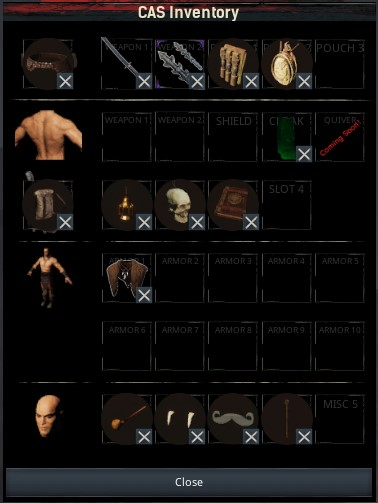
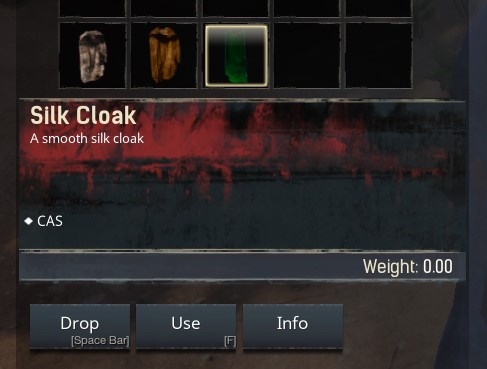
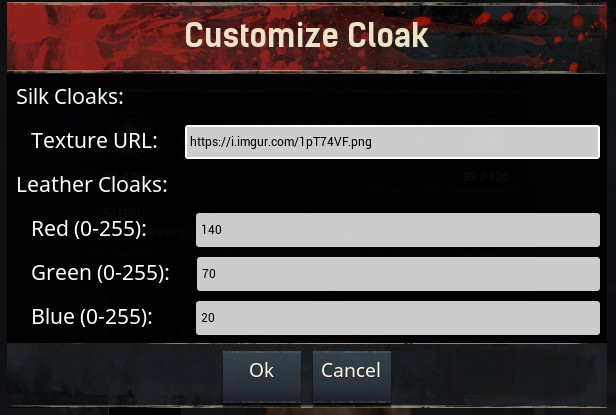

# CAS

### What is CAS?

CAS ("Customizable Attachment System") is a mod for [Conan Exiles](https://www.conanexiles.com) that adds a new inventory panel to your characters and thralls, allowing you to equip _much_ more than the 5 standard armor slots.

### Which items can I equip?

#### Weapons

You can equip any combination of weapons and/or shields on an appropriate location: either on your belt, on your back, or on your backpack (see below).
Most weapons have subtle physics on them, so they will dangle at your hip as you walk!

#### Belts

There is a **belt** system which allows you to craft and equip belts. The better the quality of the belt, the more **pouch** slots it will unlock. In these pouch slots, you can equip... pouches! Some pouches (and flasks) are cosmetic, other pouches are functional attachments: each equipped pouch will give your character a specific buff.

#### Backpacks

By learning the appropriate feat, you can also craft **backpacks**. When you equip these, you will unlock one or more backpack slots, into which you can attach more weapons, torches or decorative traveling items.

#### Layered Armor

In the armor slots, you can place pieces of armor, which will render their looks on top of whatever you are currently wearing.
This way, you can create a "layered" armor look. Of course, only the base armor will provide stats, the layered armor is purely cosmetic!

#### Cloaks

There are several craftable cloaks that you can equip, also physics-enabled.
Two of the cloaks are further customizable:

- **Leather cloaks** can have a customized color.
- **Silk cloaks** can have a custom image texture applied to them.

To customize a cloak, select it in your (regular) inventory, and press "Use".

Enter either an image URL (for silk cloaks), or an RGB value (for leather cloaks) and press "Ok".

#### Misc Cosmetics

CAS also offers a number of miscellaneous cosmetic items that you can equip in the Misc slots. These include smoking pipes, monocles, vampire teeth, moustachios, etc!

### Where are these items? How can I craft them?

In order to craft the CAS items, you need to learn the feats first:

- **Belt Crafter**: unlocks the crafting of belts and pouches
- **Backpack Crafter**: unlocks the crafting of backpacks
- **Wearable Accessory Crafter**: unlocks the crafting of all other cosmetic items

Once you have learned these feats, you can craft the items in various crafting stations:

- **Belts and Pouches**: can be crafted at the *Armorer's Bench*. The high-tier belt can be crafted at the *Improved Armorer's Bench*.
- **Backpacks**: can be crafted at the *Armorer's Bench*. The high-tier backpack can be crafted at the *Improved Armorer's Bench*.
- **Cosmetics**: can be crafted at the *Artisan Table*.

### For Admins and Modders

- The ID of this mod is `2086135111`

- This mod uses the item range `642000` - `642999`

- CAS always tries to display custom weapons and armor appropriately, but sometimes, the positioning may be off. To remedy this, CAS also has
a system to correct positioning of custom items. If you wish to use this in your own mod, please reach out to me!

- This mod is open source! You can find the Unreal assets here on GitHub. Feel free to take a look around, clone the repo, and try it out for yourself in the Conan Exiles devkit. I am always looking to improve the code, so any feedback is welcome! Or, if you are feeling generous, why not send me a pull request with fixes, improvements or new features? ;)
